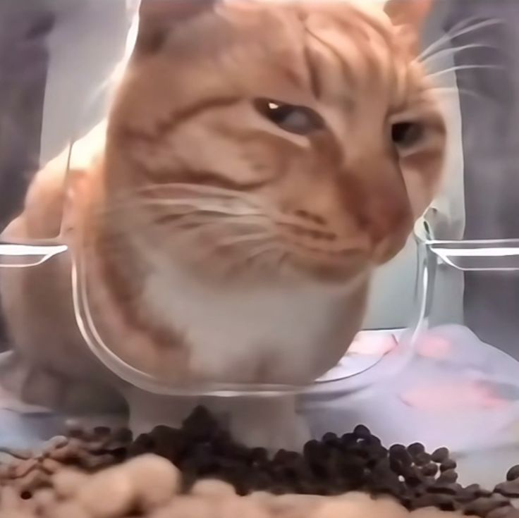
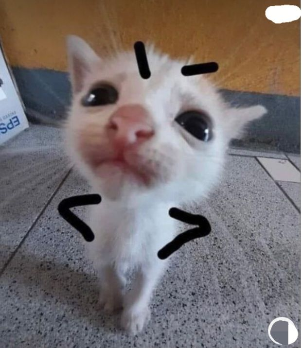

# Cat png

Place your cat PNG files here with names like:
- cat-meme-1.png
- cat-meme-2.png 
- cat-meme-3.png 
- 
- 
- 
- 
- 
- 
- 
- 
- 
- etc.

These will be randomly shown to users when they complete tasks or activities!
